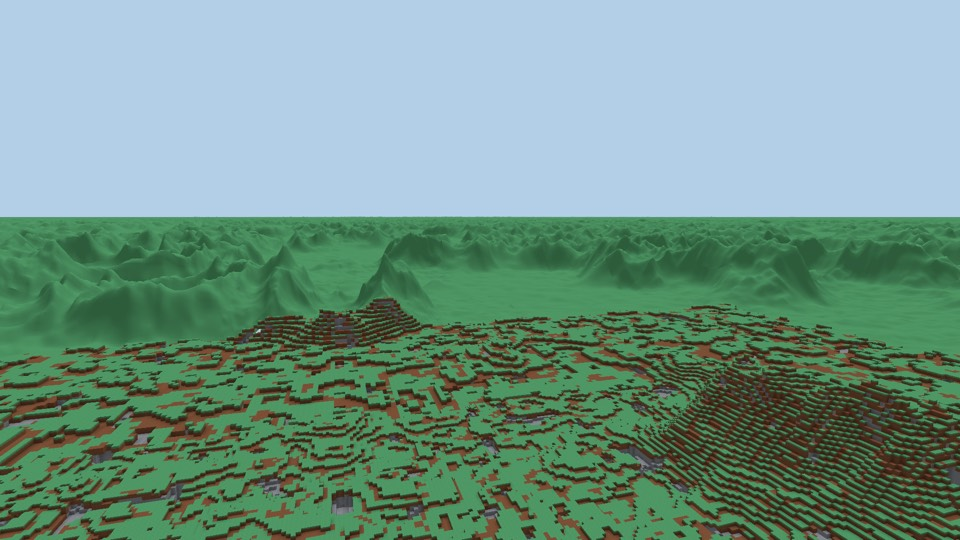
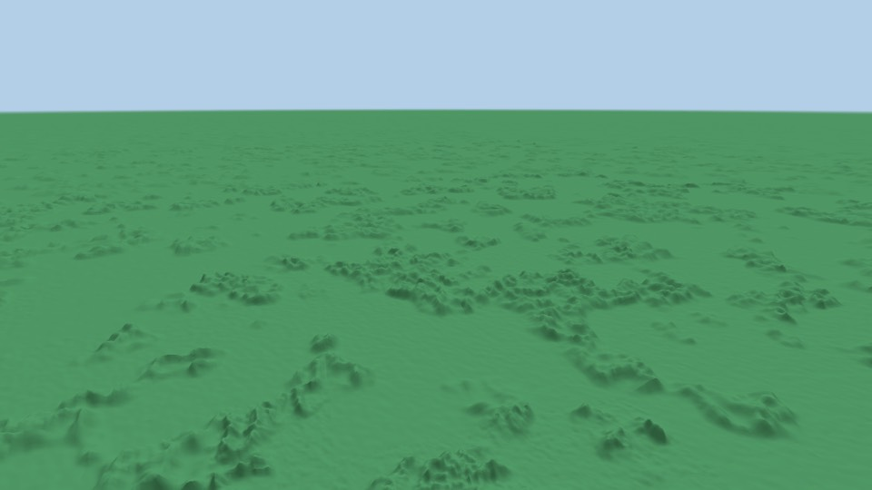

# Proposal: seeing hundreds of kilometres

**Status: proposed 2026-09-26. The direction is set, and nothing is built yet.**
The experiments behind the numbers are on the branch `exp/far-view-octree`: a
few constants changed and one probe added, not for merging.

## What the owner asked for, and has already decided

On 2026-09-14, after climbing a mountain (#264): *"verder zie je nog wel de
boundaries als je op de berg staat. zou chiller zijn als je echt oneindig ver
kon kijken."* On 2026-09-26 the owner answered four questions:

| Question | The owner's answer |
|---|---|
| How far? | *"daadwerkelijk oneindig … ik wil dat je daadwerkelijk honderden kilometers kan zien, als je hoog genoeg bent en het landschap mee werkt. hiervoor is het dus nodig dat lod extreem goed werkt"*. **262 km first**; go further only once that is measured. |
| What does the distance look like? | *"het moeten geen grote rechthoeken lijnen. ze moeten wel bergvormig zijn, maar je moet natuurlijk niet elk blok renderen. ik zou ff kijken wat hier slim is. het moet er wel uitzien alsof elk blok gerenderd is"* |
| Does the 1000-FPS gate measure what you see? | **Yes.** |
| Measured how? | **Three fixed first-person eyes**, at ground (y = 40), on a hill (y = 300) and in flight (y = 3,000), each at the full view distance and each at 1,000 FPS or more on both machines. |

The gate change is the owner's call, and this table is the record of him making
it. `ROADMAP.md` notes it as well.

The owner left one thing open on purpose: how to make distant terrain look as
if every block were rendered without rendering every block. That is §3. It is an
engineering choice, and the owner asked for it to be made well.

`ROADMAP.md` requires a phase-3 feature to be proposed in writing before it is
built. This is that proposal.

---

## §1 What exists now

| | Where | Value |
|---|---|---|
| Ring schedule | `crates/world/src/node.rs` `DEFAULT_RING_SCHEDULE` | levels 0–3, outer ring 64 chunks = **1,024 blocks** |
| Far plane | `crates/render/src/render.rs` `FAR_PLANE` | 2,000 blocks |
| Fog | `Lighting::fog_range(render_radius_blocks())` | ends inside 1,024 blocks, and exists to hide the edge |
| Vertical reach | `desired_nodes_3d` | a cube: 1,024 blocks up or down (`VERTICAL_LOD_SQUASH` coarsens detail vertically, not reach), so **from 3 km up nothing is drawn** — *corrected 2026-09-26; this row first said 512* |

## §2 What the measurements say

All measured on the M3 (Metal) at 1920 × 1080 with a 60° vertical field of
view. FPS at these scene sizes is noisy between runs (`BENCHMARKS.md`), so CPU
per frame is the column to compare. The bench's fixed-eye camera turns a full
circle, pitched down about 14°.

### A. The obvious approach: keep doubling the rings

Rings extended to level 11, the far plane moved out of the way, nothing else
changed:

| Eye | View distance | Nodes drawn | Triangles | Vertex arena | FPS | CPU/frame |
|---|---|---|---|---|---|---|
| ground, y = 40 | 1 km (today) | 1,940 | 820k | 41% | 3,482 | 0.218 ms |
| ground, y = 40 | 262 km | 4,955 | 1.30M | 65% | 2,309 | 0.329 ms |
| hill, y = 300 | 1 km (today) | 869 | 437k | 22% | 3,203 | 0.275 ms |
| hill, y = 300 | 262 km | 3,963 | 928k | 46% | 2,401 | 0.280 ms |
| flight, y = 3,000 | 1 km (today) | **0: nothing is drawn** | | | | |
| flight, y = 3,000 | 262 km | 2,545 | 283k | 14% | 5,558 | 0.157 ms |

It is affordable, because each ring is twice as coarse as the one inside it. It
is also **not what the owner asked for**, for two reasons.

**It flattens the world.** A node is a cube with the same cell size on every
axis (`PHASE1_ARCHITECTURE.md` §6.2), so a surface can only sit at a cell
boundary. The probe (`far_view_probe` on the experiment branch) asks how high
two columns are drawn at each level. One is plain ground, truly at y = 28. The
other is the tallest peak in a 16 km square, truly at y = 242.

| Level | Cell | Drawn at | Plain (true 28) | Peak (true 242) |
|---|---|---|---|---|
| 0–3 | 1–8 blocks | 0–1 km | 29–32 | 232–243 |
| 4–6 | 16–64 | 1–8 km | **48–64** | 192–224 |
| 7–8 | 128–256 | 8–32 km | **0** | **256**, one box |
| 9–11 | 512–2,048 | 32–262 km | **0** | **0** |

From 8 km out, the land falls to a flat plane at y = 0. From 3 km up that plane
is what you see:

*The straight edge is where level 6 meets level 7, at 8 km. Beyond it are the
stone tops of the y = 0 plane. The green islands are hills tall enough to
survive a 128-block cell.*

**It is made of big rectangles, by construction.** Level *L* is used from
64 × 2^*L* blocks away, so every coarse cell appears at 1/64 of a radian, which
is **about 16 pixels wide**. That holds at every level and every distance, and
it is exactly the "grote rechthoeken" the owner does not want. The rectangles
are already there today, between 160 m and 1 km:

| Level | Starts at | One cell on screen | Today? |
|---|---|---|---|
| 1 | 160 blocks | 13 px | yes |
| 2 | 288 | 14 px | yes |
| 3 | 512 | 16 px | yes |
| 4 and further | 64 × 2^*L* | 16 px | only in the experiment |

### B. When is a block smaller than a pixel?

At 1080p a pixel is 0.97 milliradians. A block is therefore one pixel wide at
**1,030 blocks**, and smaller than a pixel beyond that. At 1440p that distance
is 1,375 blocks, and at 4K it is 2,060.

This splits the problem in two:

- **Beyond ~1 km no single block can be seen.** What can be seen is the shape of
  the land (its silhouette and height), and the colour a pixel's worth of blocks
  adds up to: grass tops, soil and stone on the steps between them, lit by the
  sun from one side. Reproduce both and it is indistinguishable from rendering
  every block. Neither needs a block to be drawn.
- **Within ~1 km blocks are 1 to many pixels**, and there is no shortcut: a
  block that can be seen has to be drawn as a block.

### C. What drawing every visible block within 1 km costs

The near field was given a schedule in which no cell is wider than 2 px: level
0 out to 512 blocks and level 1 out to 1 km. The vertex arena had to be enlarged
just to hold it.

| Eye | Today: FPS / meshed triangles | ≤ 2 px cells: FPS / meshed triangles |
|---|---|---|
| ground, y = 40 | 3,482 / 0.82M | **955** / 4.86M |
| hill, y = 300 | 3,203 / 0.44M | **695** / 3.98M |

That is six times the geometry, and **below the gate** on the M3. So the band
between 160 m and 1 km cannot be made pixel-exact by adding geometry. §3.5 says
what this proposal does about it: nothing yet, deliberately.

---

## §3 The design

### 3.1 The criterion, made checkable

*"Het moet eruitzien alsof elk blok gerenderd is"* becomes: **no simplification
changes what a pixel shows by more than about a pixel of geometry, compared
with drawing every block.** The two regimes in §2B meet it in different ways,
and each way is a pure function that a unit test can check:

- For geometry, the projected size of every cell drawn is at most *k* px. This
  is a function of the schedule and the eye, and needs no GPU.
- For colour, the aggregate block shading (3.3) of a staircase must match the
  area-weighted colour of the actual blocks it stands for, computed by brute
  force on the CPU for a set of slopes and view directions.

The owner judges the result with his eyes, from golden images taken at the
three gate eyes. The tests exist so that a later commit cannot quietly undo
what he approved.

### 3.2 Two regimes, two representations, no overlap

| Distance | What is drawn | How |
|---|---|---|
| **0 – ~1 km** | voxels, as today | the node tree, unchanged: rings capped at 1,024 blocks |
| **~1 km – 262 km** | **far terrain**, new | a height-field mesh with block-aggregate shading (3.3) |

The far terrain is the new system. It **does not extend the node tree**: table A
shows that rings of cubes flatten the land and are made of rectangles. Instead:

- **A quadtree of height-field patches**, each a grid of 32 × 32 quads
  (`crates/world/src/far.rs`). A patch is split for two reasons:
  - **by distance**, while its quads would look wider than 16 px. That caps
    the triangle count by the screen, not by the view distance;
  - **by height error**, while its own measured gap to the next finer patch
    would look taller than 1 px. This puts fine patches where the land is
    rough (mountains) and leaves flat land coarse. It stops at a floor of
    2 px quads, because below that it only chases one-block steps, which a
    smooth surface cannot follow anyway.
- **Why not distance alone, as CDLOD does (*revised 2026-09-26, measured in
  F3a*).** The first plan was CDLOD (Strugar 2010): distance-only splitting,
  with geomorphing between levels. Measured from the hill eye out to 25 km,
  against the ground each pixel covers:

  | Quads by distance | Height bound | Mean error | p90 | Triangles, 262 km (all patches) |
  |---|---|---|---|---|
  | 16 px | none | 0.61 px | 1.58 px | 1.2M |
  | 8 px | none | 0.39 px | 1.04 px | 3.3M |
  | 4 px | none | 0.24 px | 0.61 px | ~13M |
  | **16 px** | **1 px** | **0.30 px** | **0.75 px** | **3.7M** |
  | 16 px | 2 px | 0.55 px | 1.42 px | 1.5M |

  Under distance alone, getting nine columns in ten under a pixel takes 4 px
  quads everywhere, which is about 13M triangles. The height bound gets the
  same accuracy for about a quarter of that. The triangles in view at once
  are about a quarter of "all patches", but the bench measures that with the
  real frustum (F3c).
- **Skirts, not geomorphing.** A split for roughness can leave a fine patch
  beside one two levels coarser, and geomorphing cannot blend across that.
  Each patch drops a skirt along its edges, as the voxel nodes already do
  (`PHASE1_ARCHITECTURE.md` §6.4). The popping that geomorphing would have
  hidden is kept under a pixel by the same height bound.
- **Heights come from the generator, prefiltered.** A vertex's height is the
  mean of `WorldGen::surface_height` over the footprint of its quad, sampled
  on a grid of at most 4 × 4. The terrain
  is a height field with caves beneath it (§8.1), so from kilometres away the
  height field is the complete visible truth. The patches are generated on the
  existing worker threads, like today's mesh jobs, and hold 33 × 33 heights plus
  a material summary each. That is small enough that the whole 262 km view fits
  in a few megabytes.
- **Vertical precision is not tied to cell size.** Heights are real numbers, not
  lattice steps, which is exactly what table A's cubes lack.

### 3.3 Block-aggregate shading: making it look like every block

A slope made of blocks is a staircase. From far away, each pixel covers many
steps, and the colour it shows is a mix of two kinds of face:

- **top faces** (grass, snow and so on), normal straight up, lit by the sun
  from above;
- **side faces** (soil near the top of a step, stone on tall cliffs), normals
  along ±x and ±z, lit or in shadow depending on which way they face the sun.

For a slope with gradient (*g*ₓ, *g*_z) in blocks per block, every unit of
ground carries one unit of top area and |*g*ₓ| and |*g*_z| units of side area.
How much of each is visible depends on the view direction. The fragment shader
knows the gradient (from the patch's heights), the view direction, the sun, and
the materials, so it computes the **area-weighted, visibility-weighted mix of
the faces the blocks really have**. A gentle hill comes out mostly grass. A
cliff comes out stone-grey with its sunlit side brighter than its shaded side,
and it reads as a cliff made of blocks rather than a smooth grey slope. This is
what makes the distance look like blocks without a block being drawn.

The CPU brute-force check in 3.1 is what keeps this honest: generate the actual
staircase, render its faces' areas and lighting by counting, and compare.

**Revised 2026-09-27, measured while building the reference
(`crates/render/src/aggregate.rs`).** "Area-weighted, visibility-weighted" is
the right idea, but the obvious formula for it is wrong. Weighting each face by
its projected area (area times the cosine to the eye, for faces turned toward
it) is exact only while every riser faces the eye. When the risers along one
axis face the eye and those along the other face away, the steps along the
second axis drop away from the eye and hide what is behind them. What they hide
depends on how the steps along the two axes interleave, not on the areas.

| Slope | Seen from | Risers' share, projected areas | Risers' share, counted |
|---|---|---|---|
| 0.1 along both axes | along its contours, 2° up | 0.67 | 0.05 |
| 0.5 along both axes | along its contours, 2° up | 0.91 | 0.24 |
| 1 along x, -0.4 along z | 35° up, 45° azimuth | 0.29 | 0.52 |

The first row is a gentle hill seen side-on from far away, which is most of what
the far terrain is. Projected areas would draw it two-thirds soil. The counted
answer, derived by hand as well as measured, is 95% grass.

**The view along the contours, by hand.** Take a slope of *g* < 1 along both
axes, seen from just above the ground straight along its contour lines. A line
of sight along a contour runs diagonally through the columns and alternates
between two diagonals of cells. Their smooth heights differ by *g*, so after
rounding to whole blocks the second diagonal is one block higher than the first
on a fraction *g* of the lines, and level with it on the rest. A ray that skims
the ground stops at the first of the highest columns it reaches:

- on a line with no steps, every ray lands on a top;
- on a line with steps, the highest columns take half the line's length. A ray
  sinking below their top level lands on a step's top if it is over one at that
  moment, which happens half the time, and otherwise on the riser of the next
  step.

So the risers' share is *g*/2: 0.05 for the gentle hill, where projected areas
give 0.67. The facing risers are almost all hidden, because each one stands
directly behind a step down along the other axis that is just as high. This
case is a test (`a_slope_seen_along_its_contours_matches_the_hand_count`),
and it is the second check on the reference, independent of the ray caster.

So the shading is done in three layers:

- **The definition** (`reference_weights`): walk lines across a real
  staircase and add up what the eye sees along them. It matches rays cast at the
  blocks one by one to within 0.004, and a case worked out by hand.
- **A table** (`MaskingTable`, 16⁴ bytes, 64 KB, committed as
  `aggregate.table`) for the one arrangement that hides anything. It is indexed
  by slope steepness `s / (1 + s)`, the lean between the axes
  `g_B / (g_A + g_B)`, and the two projected-area ratios, so the part that
  changes fast is in the coordinates and the table only holds what hiding
  changes. A first version indexed by elevation and azimuth was off by up to
  0.6 at grazing angles. Steepness and lean were first angles; as ratios they
  cost the shader no arctangent, and are as accurate.
- **The shader's rule** (`visible_weights`): projected areas where nothing
  hides, tops alone where every riser faces away, and the table where one axis
  hides the other. Over 2,000 random slopes and views it is within 0.0013 of
  the definition on average, 0.003 at the 95th percentile, and 0.25 at worst.
  The worst cases are slopes seen almost edge-on, which cover few pixels.

**In `far.wgsl` (F4, 2026-09-27), the shading runs per vertex, not per
fragment** (a revision of "the fragment shader ... computes" above). Quads are
at most about 16 px across by the split rule, so the view direction barely
turns across one, and the slope is interpolated either way. Measured at the
gate eyes on the GTX 1060, GPU time per frame, same session:

| | Plain (F3) | F4 per fragment | F4 per vertex | F4 per vertex, no arctangent |
|---|---|---|---|---|
| flight | 0.38 ms | 0.75 ms | 0.38 ms | 0.36 ms |
| hill | 0.50 ms | 0.67 ms | 0.54 ms | 0.52 ms |
| ground | 0.58 ms | 0.57 ms | 0.62 ms | 0.57 ms |

(`--bench 64 --eye … --far`, High, each the typical of two or three runs,
leaving out a first run that includes warm-up.)

Per fragment it would have cost the flight eye half its frame rate. Per vertex
and without the arctangents, it costs the same as the plain shading, to within
the noise, and the per-fragment version and the per-vertex
one differ on 0.2% of a golden's pixels, all on ridge lines. A test renders
slopes of known gradient and checks the pixel against `aggregate_colour` to
one step of 8-bit colour, through every branch and the table's texture
layout.

**A riser shows the blocks it cuts through**: the side of the surface block
at its top, then soil to `SOIL_DEPTH`, then stone (`riser_colour`). A gentle
slope's risers are grass-sided; a mountain face seen from far away shows the
soil and stone of its steps, which is what reads as a mountain made of
blocks.

### 3.4 Joining the two

- The far terrain starts where the voxel rings end. It is drawn after the voxels
  with a depth test, and never draws the same ground they do. *As built (F3c):*
  not by discarding fragments, which on a tile-based GPU turns off hidden-
  surface removal for the whole pipeline, but in the vertex shader. Vertices
  strictly inside the voxels' box sink to its floor. The box's edges fall on
  multiples of 128 blocks, and so does every quad edge near them, so no
  triangle straddles the edge. The triangles touching it from inside slope down
  from it, and that slope is a wall that closes the seam between the two.
- At the join, a block is about 1 px wide at 1080p (§2B). At 4K it is about
  2 px, so the join is slightly visible there. The join distance can be made to
  follow the resolution.
- It needs one new pipeline, built in `scene.rs` like every other one, inside
  the one `encode_scene`. The window, the bench and the screenshot keep sharing
  that single path, so Rule 5 and `check-single-render-path.sh` hold as they
  are.
- **The far plane becomes infinite** (free with reverse-Z), and **fog becomes
  haze**: an atmosphere tens of kilometres thick rather than a wall hiding an
  edge. The owner sets its strength by looking at it.

### 3.5 What this does not solve, on purpose

- **The band between 160 m and 1 km.** Its cells are 13–16 px wide today (§2A),
  and making them pixel-exact costs six times the geometry and the gate (§2C).
  Options for later, each to be judged from images: (a) leave it as it is; (b)
  keep coarse geometry but give the tops of coarse cells the colours of their
  actual blocks, so only the silhouette is coarse; (c) bring the far terrain
  closer, which smooths blocks that are still 2–4 px wide. That choice is the
  owner's, once F3 gives images to judge from.
- **Caves, overhangs and trees beyond 1 km.** Caves and overhangs are not in a
  height field. A 10-block cave mouth at 1 km is about 10 px, so a dark spot in
  the material summary may be worth adding. Forests could be a darker, bumpier
  green in the material summary. Both are for F6, if the images call for them.
- **Your builds in the distance.** They show only in the voxel region, as they
  do today.
- **Travelling hundreds of kilometres.** Seeing 262 km needs nothing more.
  Standing 262 km from the origin needs camera-relative rendering, because
  `f32` positions jitter at that distance. That is separate work.
- **The world is flat.** Nothing curves away. Past a point, how far you see
  depends on what the land hides, not on the curvature of the world.

## §4 The admission rule

- **(a) What it deepens.** The worldgen: mountain ranges (#259) and the unlimited
  height of the world (#175) become things you see from far away and navigate
  by. Climbing and flying in creative mode now show you something. The generator
  gets a second consumer, which uses the same pure function.
- **(b) What it makes possible.** Finding your way by landmarks. Seeing the range
  you will walk to next. Building high in order to look out.
- **(c) What it replaces.** The edge of the world: the fog wall, `FAR_PLANE`, and
  the 1,024-block limit on what exists visually. It also replaces `--bench 64`'s
  orbit as the gate (the owner's decision, above). The ring extension of §2A,
  the obvious approach, is rejected rather than added alongside.

## §5 Decisions left for the owner

1. **The haze.** How thick, judged from golden images.
2. **The band between 160 m and 1 km** (3.5), judged from F3's images.

Both come with images, not questions in the abstract.

**2026-09-26: the owner handed both back.** Asked about these two in the Linux
session, he said *"voor de graphics moet je ff kijken dat het er goed
uitziet"*: we are to judge from the images ourselves that it looks right. On
the Mac the same day he asked for the smart approach to be worked out rather
than brought to him (*"ik zou ff kijken wat hier slim is"*). So the haze and
the band are settled from images by whoever builds F5 and F6, the images still
go in the PR for him to see, and the tests still pin what was chosen.

## §6 Plan, in order

| # | Block | Why here |
|---|---|---|
| **F1** | **The gate first.** `--bench` gains the three eyes, and `check-phase-gate.sh` uses them. They are recorded on both machines before anything is built. | The same order as phase 1's block 1.0: measure the target first. The eyes' view distance grows with F3, and the gate grows with it. |
| **F2** | **The criterion as tests.** The projected-cell-size function, with a test that today's rings fail it at 13–16 px, which proves the test can fail. Plus the brute-force staircase reference for 3.3. | So F3 and F4 are built against a check rather than a screenshot. |
| **F3** | **Far terrain, plain-shaded.** The patches, split by distance and by height error, with skirts and prefiltered heights; the infinite far plane; the join at 1 km. F3a (the GPU-free half: `crates/world/src/far.rs`) is first. | The core. Golden images at the three eyes, before and after. |
| **F4** | **Block-aggregate shading** (3.3) | What makes it look like blocks. |
| **F5** | **Haze** replaces the fog that hides the edge | Tuned by the owner from images. |
| **F6** | Whatever F1–F5's measurements and images say is still missing | For example the 160 m – 1 km band, cave mouths, or forests. Written from evidence, as block 1.11 was. |

**The Windows laptop is needed at F1 and F3**: the gate runs on both machines.

## §6b Where F3 stands (2026-09-26)

Built: F3a (patches and heights), F3b (the renderer), F3c (streaming in the
window, the bench, screenshots). The same two views as table B, now:

**The gate is not met on the M3** at the ground and hill eyes. Measured at
the shipped settings (16 px quads, 2 px bound on each patch's 99th-percentile
gap, 4 px floor), repeated runs on a warm machine:

| Eye | Without the far terrain | With it (262 km) | Far triangles drawn |
|---|---|---|---|
| ground, y = 40 | ~3,100 FPS | **826–873 FPS** | ~720k |
| hill, y = 300 | ~3,500 FPS | **878–1,105 FPS** | ~730k |
| flight, y = 3,000 | nothing in view | 1,546–1,634 FPS | ~550k |

The spread on the same code is ±15–20%, which is this machine's thermal state
(see `BENCHMARKS.md`, "the gate measures a hot machine"). The far terrain
costs about 0.9 ms a frame on the M3.

Tried, with the measured effect at the gate eyes:

- **Kept:** back-face culling (+13–28%); patches nearest first (+20% at the
  ground eye); vertices sunk into the hole instead of fragments discarded
  (+3–12%, and it closes the seam at the join); a 4 px floor for splits
  (−45% patches, p99 1.80 → 2.72 px).
- **Dropped, no measurable gain:** a coarser distance rule (32–128 px; the
  height bound decides the count); terrain horizon culling (8 of 312 patches
  at the ground eye, because from 12 blocks up the distant band really is
  visible); skirts only where needed (within noise); normals from screen
  derivatives (within noise, and it looks worse).
- **Trades quality:** a 3 px or 4 px bound instead of 2 px (fewer triangles;
  its FPS effect was inside this machine's noise in single runs).

What is left is the owner's choice (§5): accept a coarser far terrain, accept
the M3 below 1,000 FPS with it, or have the next piece of work be the
renderer's cost per triangle. Seen almost edge-on from a low eye, the far
terrain puts several triangles in each pixel. The fix for that is geometry
that is coarser along the line of sight than across it, which is a bigger
change. Windows has not been measured yet.

## §6c Quality per PC (the owner's answer to §6b)

The owner chose not to pick one setting for every machine: a benchmark decides
per PC, the player can choose looks or frame rate, and the frame rate to hold
is the monitor's refresh rate (`ROADMAP.md` has his words). What was built:

| Quality | Quads (distance) | Height bound | Floor | Measured on the hill eye (§3.2) |
|---|---|---|---|---|
| High | 16 px | 2 px | 4 px | p99 2.72 px |
| Medium | 16 px | 4 px | 4 px | p99 3.39 px |
| Low | 32 px | 6 px | 8 px | coarser |
| Off | the voxels only, 1 km | | | |

- **The benchmark** (`cubara --bench tune --target <fps>`) runs the three gate
  eyes at each quality, best first, and keeps the first that holds the target
  at all of them. It writes the answer to `saves/settings.ron`, with the target
  and the GPU it was measured for.
- **The game** reads that file at start. If this PC has not been benchmarked
  for its monitor's refresh rate and GPU, the game runs the benchmark itself in
  a child process and switches quality when the answer lands.
- **In play**, a frame waiting for the display takes a whole number of
  refreshes, so a missed refresh shows as a frame of about twice the budget.
  When a fifth of the frames in three seconds miss, the quality steps down one
  level and the file remembers it. It never steps up: a frame waiting on the
  display cannot tell how much faster it could have been, so finding headroom
  is the benchmark's job.
- **The options** (pause menu, O): keys 1–4 pick a quality, which is then the
  player's own, so no benchmark or step-down overrules it. A gives the choice
  back to the benchmark, and B runs it now.
- **The gate** (`--bench gate`) reports the best quality that holds 1,000 FPS
  at every eye. `Off` can never pass it, because the flight eye must see
  something.

## §7 How it is checked

- **Geometric error:** a unit test that every drawn far-terrain quad projects to
  at most *k* px from each gate eye. It is a pure function, with no GPU.
- **Colour:** a unit test that aggregate shading matches brute-force block
  counting, within a tolerance, over slopes, view directions and sun
  directions. Built in `aggregate.rs`, with its bounds, and with a test that
  the projected-area mix fails them (3.3).
- **Silhouette:** the probe's peak and plain, drawn by the far terrain within
  one pixel of their true height at every distance. Today's rings fail this
  from 1 km (§2A), so it is a test that can fail.
- **Golden images** at the three gate eyes, looked at by the owner before
  they are committed.
- **A `BENCHMARKS.md` row per gate eye.**

## §8 Sources

- F. Strugar, *Continuous Distance-Dependent Level of Detail for Rendering
  Heightmaps*, JGT 2010 ([pdf](https://aggrobird.com/files/cdlod_latest.pdf)):
  the quadtree, the distance-based split, and geomorphing without skirts. It
  was the first plan, and §3.2 records why the measurements replaced its
  distance-only split with a height-error bound and skirts (the chunked-LOD
  idea: split where the error would show, not everywhere at a distance).
- A. Tevs, I. Ihrke, H.-P. Seidel, *Maximum mipmaps for fast, accurate, and
  scalable dynamic height field rendering*, I3D 2008
  ([ACM](https://dl.acm.org/doi/10.1145/1342250.1342279)). Ray-casting a height
  field is the alternative. It gives exact blocks at every distance, at a cost
  per pixel. It was not chosen because that cost lands on a 1 ms frame budget,
  and point-sampling sub-pixel blocks needs filtering anyway, which gives back
  what 3.3 already does.
- Voxel-game LOD mods (Distant Horizons, Voxy) render simplified voxel geometry
  far away. That is the approach of §2A, and its cells are the rectangles the
  owner rejected.
