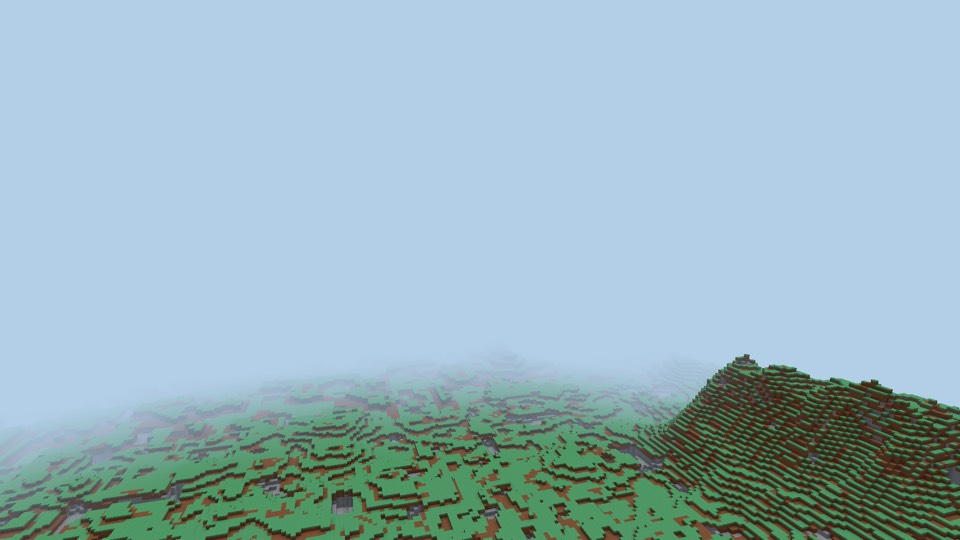
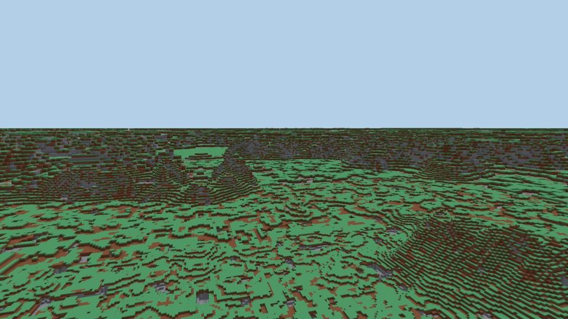

# Proposal: seeing hundreds of kilometres

**Status: proposed 2026-09-26, waiting for the owner.** Nothing here is built.
The experiment behind the numbers is the branch `exp/far-view-octree`
(`0768426`): two constants changed and one probe added, not for merging.

**What the owner asked for.** On 2026-09-14, after climbing a mountain (#264):
*"verder zie je nog wel de boundaries als je op de berg staat. zou chiller zijn
als je echt oneindig ver kon kijken."* Asked on 2026-09-26 how far, the
answer was:

> *"daadwerkelijk oneindig. ik denk dat we er een nieuw systeem voor nodig
> hebben, maar ik wil dat je daadwerkelijk honderden kilometers kan zien, als je
> hoog genoeg bent en het landschap mee werkt. hiervoor is het dus nodig dat lod
> extreem goed werkt"*

Asked in the same exchange whether the 1000-FPS gate should then measure the
distance a player actually sees, rather than the 1,024 blocks it measures now,
the owner chose **yes, measure what you see**. That changes a phase gate, which
is the owner's call, and this is the record of them making it. Rewriting the
gate is block F1 below, so the gate never measures less than the game draws.

`ROADMAP.md` requires a phase-3 feature to be proposed in writing before it is
built. This is that proposal. It says what the measurements found and what they
mean for "a new system", then lists the decisions that belong to the owner.

---

## §1 What exists now

| | Where | Value |
|---|---|---|
| Ring schedule | `crates/world/src/node.rs` `DEFAULT_RING_SCHEDULE` | levels 0–3, outer ring 64 chunks = **1,024 blocks** |
| Far plane | `crates/render/src/render.rs` `FAR_PLANE` | 2,000 blocks |
| Fog | `Lighting::fog_range(render_radius_blocks())` | ends inside 1,024 blocks, and exists to hide the edge |
| Vertical reach | `VERTICAL_LOD_SQUASH` = 2 | the drawn cube is half as tall as it is wide: **512 blocks up or down** |

The last row means a player 3 km up today sees **nothing at all**. The bench
refuses that scene as empty (table A).

## §2 What the measurements say

All measured on the M3 (Metal). The FPS figures carry the usual caveat
(`BENCHMARKS.md`): at these scene sizes FPS is noisy between runs, and CPU per
frame is the column to compare. The bench's fixed-eye camera turns a full
circle, pitched down about 14°.

### A. Cost: extending today's tree is affordable

Rings keep doubling out to level 11, the far plane is moved out of the way, and
nothing else changes:

| Eye | View distance | Nodes drawn | Triangles | Vertex arena | FPS | CPU/frame | First fill (1 thread) | Visibility search |
|---|---|---|---|---|---|---|---|---|
| ground, y = 40 | 1 km (today) | 1,940 | 820k | 41% | 3,482 | 0.218 ms | 4.8 s | 36 ms |
| ground, y = 40 | **262 km** | 4,955 | 1.30M | 65% | 2,309 | 0.329 ms | 11.6 s | 93 ms |
| hill, y = 300 | 1 km (today) | 869 | 437k | 22% | 3,203 | 0.275 ms | 2.0 s | 60 ms |
| hill, y = 300 | 16 km | 2,713 | 886k | 44% | 2,250 | 0.316 ms | 5.5 s | 90 ms |
| hill, y = 300 | 65 km | 3,477 | 923k | 46% | 2,445 | 0.280 ms | 7.1 s | 99 ms |
| hill, y = 300 | **262 km** | 3,963 | 928k | 46% | 2,401 | 0.280 ms | 8.7 s | 114 ms |
| flight, y = 3,000 | 1 km (today) | **0 — nothing is drawn** | | | | | | |
| flight, y = 3,000 | **262 km** | 2,545 | 283k | 14% | 5,558 | 0.157 ms | 5.5 s | 131 ms |

Going from 1 km to 262 km, 256 times further, costs about 3,000 more nodes and
a third of the frame rate at ground level. At the worst eye that still leaves
2.3 times the gate. This is the octree doing what it was built to do: each ring
is twice as coarse as the one inside it, so doubling the distance adds a roughly
constant number of nodes, not four times as many. The first fill of 11.6 s on
one thread comes to about 2 s across the worker pool, nearest node first.

**So the structure does not need replacing.** Performance is not what stands
between the game and hundreds of kilometres.

### B. Fidelity: far away, the mountains disappear

The probe (`far_view_probe::peak_height_per_level` on the experiment branch)
takes two columns of the default seed. One is the highest peak in a 16 km
square, with its top at **y = 242**. The other is plain ground at the median
height around it, **y = 28**. For each detail level, the probe asks how high
each column is drawn:

| Level | Cell size | Drawn at distance | Plain (true 28) | Peak (true 242) |
|---|---|---|---|---|
| 0–2 | 1–4 blocks | 0–512 m | 29–32 | 240–243 |
| 3 | 8 | 0.5–1 km | 32 | 232 |
| 4–5 | 16–32 | 1–4 km | **48–64** | 224 |
| 6 | 64 | 4–8 km | **64** | **192** |
| 7–8 | 128–256 | 8–32 km | **0** | **256**, a single box |
| 9–11 | 512–2,048 | 32–262 km | **0** | **0** |

Today's game stops at level 3, where both columns are still close. A node is a
cube with the same cell size on every axis (`PHASE1_ARCHITECTURE.md` §6.2), so
a surface can only be drawn at a cell boundary. Once cells are 16–64 blocks
tall, the plain is drawn 20–36 blocks too high. Once they are 128 blocks tall,
the plain falls inside a single cell whose centre is air, and **from 8 km out
the land drops to a flat plane at y = 0**. Only what rises above half a cell
survives, and that is why the peak lasts until 32 km, as one 256-block box.
Beyond 32 km, nothing is left.

*From 3 km up, rings extended to 262 km. The straight edge across the lower
half is where level 6 meets level 7, at 8 km. Beyond it is the plane at y = 0
the table describes: its stone tops show, and the green islands are the hills
tall enough to survive a 128-block cell.*

*From 300 blocks up. Top: today, with fog hiding the edge at 1 km. Bottom: rings
extended, with land out to the horizon but no distant ranges, and no haze to
show distance.*

### What the two tables mean together

The owner's instinct that this needs a new system is right about *what a far
node contains* and wrong only about *the tree*. The tree scales. What it holds
at a distance does not: from 8 km out, it holds a flat plane.

## §3 The design

### 3.1 Far nodes are surface, not volume

The terrain is a height field with caves carved beneath it
(`WorldGen::surface_height`, `density_at`). From kilometres away, the height
field is the only part that can be seen. So from a switch level outwards (level
4–6, settled below), a node is generated from **2D samples of the surface** at
its own cell size, and meshed as columns whose tops sit at the sampled height.
Vertical precision no longer depends on the cell size.

- **The existing vertex format already has the precision.** A vertex's `y` is 10
  bits across the node's 16 cells, so 64 steps per cell. Level *L* is only drawn
  from at least 64 × 2^*L* blocks away, which caps the vertical error at 1/4096
  of the viewing distance. That is about a quarter of a pixel at 1080p. No
  format change and no re-mesh of anything nearer.
- **The existing machinery stays:** the same rings, arena, skirts, draw path and
  visibility links. A surface node is a node whose *contents* are made
  differently. That keeps Rule 5 (one scene-render path) intact and adds no
  second system beside the tree.
- **Where the switch sits (level 4, 5 or 6) is a trade-off, and F3 settles it
  by measuring.** Surface nodes from level 4 (1 km) would fix the plain being
  drawn 20–36 blocks too high at 1–4 km (table B). But levels 4 and 5 are also
  where distant cave mouths (#255) still show: they are carved 24 blocks deep,
  and a 16- or 32-block cell can hold one. The owner asked to see those from a
  mountain. From level 6, a cell is too coarse for a cave mouth, so nothing is
  lost there. The candidates are surface nodes from level 6 with levels 4–5
  left as volume, or surface nodes from level 4 that carry cave mouths as dips in
  the height. Levels 0–3, which are all the game draws today, are unchanged
  either way.
- **It is cheaper than what it replaces:** 16 × 16 surface samples per node
  instead of 16 × 16 × 16 density samples.

### 3.2 The far plane goes, and fog becomes atmosphere

Reverse-Z depth (already in place) makes an infinite far plane free. Fog today
exists to hide the edge of the world. With the edge hundreds of kilometres away,
it becomes **haze**: the colour fades toward the sky over tens of kilometres.
That is what lets an eye read distance at all. The flat, busy horizon in the
third picture has none.

### 3.3 How far

Each level doubles the distance for roughly a constant number of nodes. Level 11
is 262 km and level 13 is about 1,000 km. "Infinite" in practice means a level
cap, and choosing it is decision 1 below.

### 3.4 What this does not solve, on purpose

- **Your own builds in the distance.** Edits show only in the full-detail near
  field, about 160 blocks out, and that is true today. A tower you built
  disappears as you walk away from it. Changing that is a separate decision.
- **Travelling hundreds of kilometres.** *Seeing* 262 km does not need anything
  more. *Standing* 262 km from the origin does: at that distance `f32` world
  positions jitter by about 0.03 of a block, and the fix is camera-relative
  rendering. It is separate work, and nothing here depends on it.
- **The planet is flat.** Nothing curves away. Past a point, the sight line is
  limited by what the terrain hides, not by the curvature of the world.

## §4 The admission rule

- **(a) What it deepens.** The LOD tree (§6) gains the one property it lacks,
  height at a distance. Mountain ranges (#259) and the unlimited height of the
  world (#175) get a reason to be climbed, because the view is the reward. Flight
  in creative mode stops being a flight over nothing.
- **(b) What it makes possible.** Finding your way by landmarks. Seeing the range
  you will walk to next. Building high in order to look out.
- **(c) What it replaces.** The volumetric far node from the switch level
  outwards (the thing table B shows failing) is *replaced*, not joined by
  something new. The
  fog that hides the edge, the `FAR_PLANE` constant and the 1,024-block cap on
  the rings all go. So does the `--bench 64` orbit as the gate, which the owner
  has already decided (above).

## §5 Decisions for the owner

1. **How far?** 262 km (level 11), or about 1,000 km (level 13)?
   *Recommendation: 262 km first, measured on both machines; then decide
   whether to go further.*
2. **What do distant mountains look like?** Blocky columns, the same visual
   language the near field uses? Or smooth slopes in the distance?
   *Recommendation: blocky, one look for the whole world. Past a few kilometres
   a column is a pixel or less and the difference disappears anyway.*
3. **How strong is the haze?** It is a matter of taste, and the owner decides
   it by looking at it.
   *Recommendation: build it with a single tunable distance and decide by
   looking at golden images.*
4. **What exactly does the gate measure?** The owner said *measure what you
   see*. Concretely: three fixed first-person eyes (ground y = 40, hill y = 300,
   flight y = 3,000) at the full view distance, each at 1,000 FPS or more on both
   machines.
   *Recommendation: those three eyes. They are the three rows of table A, so the
   gate starts from numbers that already exist.*

## §6 Plan, in order

| # | Block | Why here |
|---|---|---|
| **F1** | **The gate first.** `--bench` measures the three eyes at the full view distance; `check-phase-gate.sh` uses it. It is recorded red or green before anything is built. | The same order as phase 1's block 1.0: measure the target before building toward it. |
| **F2** | Far plane infinite, rings extended to the chosen level (volume, as measured) | The edge is gone, but past 8 km the land is the flat plane table B describes. F2 is kept only if F3 follows directly; on its own it is not an improvement to ship. |
| **F3** | **Surface nodes from the switch level outwards** (§3.1) | The core. Pinned by the golden image and the unit test below. |
| **F4** | Haze replaces the fog that hides the edge | What makes distance readable. Tuned by the owner, from images. |
| **F5** | Whatever F1–F4's measurements say is still missing | For example, distant grass/soil/stone stripes aliasing into noise, if F3 does not already calm them. Written from a profile, as block 1.11 was. |

**Windows numbers are needed at F1 and at F3** (the gate runs on both
machines). That is when the Windows laptop has to be on.

## §7 How it is checked

- **A unit test from the probe.** At every level from the switch outwards, the
  drawn tops of both of the probe's columns are within one vertex step of their
  true heights. It fails today at every level from 4 upward (table B), so it
  cannot pass without the fix.
- **A golden image:** a peak 30 km away, seen from a hill, keeps its silhouette.
  It is taken before F3 and after, and both images go in the PR.
- **The ring tests** (`node.rs`: every chunk is covered exactly once, and
  neighbours differ by at most one level) are level-agnostic. Extending the
  schedule re-runs them.
- **A `BENCHMARKS.md` row per eye**, with vertex-arena occupancy. At 65% at
  ground level, the arena, and no longer the node budget, is the constraint to
  watch.
